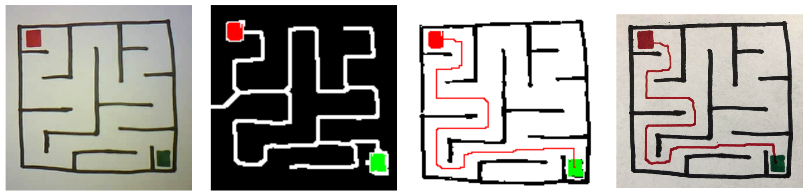
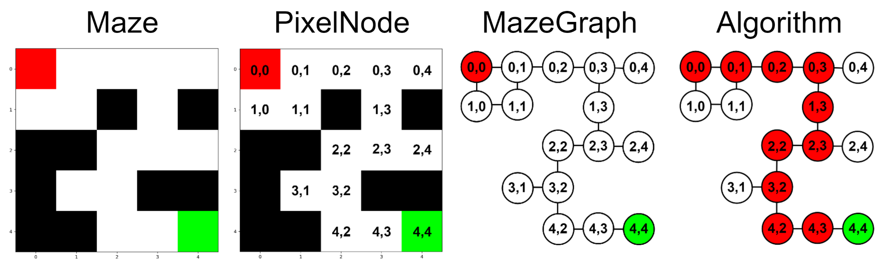

# Maze Solving Robot
Project repository for a maze solving robot. Developed a robot that automatically solves hand drawn mazes. System consists of an ESP32 camera, drawing plotter, computer vision (OpenCV), custom maze data structures and algorithms (Python), and CNC robot motion (Arduino and G-code).

[Video file](images/solution.MOV)

## System Overview
System first prompts user to hand draw maze in an indicated region and then captures an image with an ESP32-Cam. System then proceeds to process maze into a graph structure and solve with a graph algorithm. Finally, solution is converted into G-code and an Arduino and drawing plotter are used to draw the maze solution path trajectory.

## Image Capture
A custom designed camera bracket assembly integrates an ESP32-Cam with the drawing plotter. Components are 3D printed and assembly is mounted on the CNC tool head. After a user hand draws a maze, an image is captured and saved with the ESP32 [CameraWebServer](https://github.com/espressif/arduino-esp32/blob/master/libraries/ESP32/examples/Camera/CameraWebServer/CameraWebServer.ino).

## Computer Vision and Image Processing
A series of computer vision functions are used to process the raw maze image in preparation for maze solving. The primary maze image processing taks are color detection, start and end identification, and skeletonization.

#### Color Detection
- Four colors need to be detected in the hand drawn maze. Red and green sharpies are used to indicate the desired start and end of the maze. Black is used for maze walls, and white is the remaining white paper. Using [OpenCV]([url](https://github.com/opencv/opencv)), the image is converted to an HSV color space and masks are detected based on a colors range within the HSV values.

#### Start/End Identification
- The centroid of the largest red and green cluster in the color masks are used to identify start and end coordinates of the maze image. 

#### Skeletonization
- In order to reduce graph computation time and center the solution path within the maze walls, the maze image is further processed by skeletonization. This is achieved with a thinning function that effectively increases the black walls until the solution space just consists of thin white lines along with the red and green start/end regions.

## Maze Graph and Algorithm

## Motion Control

## Misc. Images
Solving a round style maze

Example of a maze solution that did not undergo skeletonization during image processing. Solution nears maze walls too aggresively and is likely to overlap on walls once physically drawn.

  

