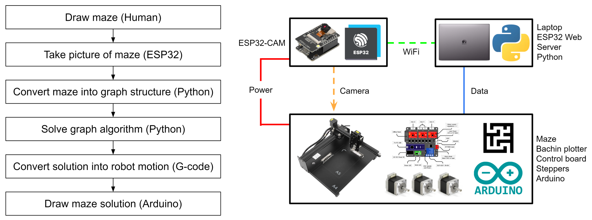

# Maze Solving Robot
Project repository for a maze solving robot. Developed a robot that automatically solves hand drawn mazes. System consists of an ESP32 camera, drawing plotter, computer vision (OpenCV), custom maze data structures and algorithms (Python), and CNC robot motion (Arduino and G-code).

[Video file](images/solution.MOV)

## System Overview
System first prompts user to hand draw maze in indicated region and then captures image with ESP32-Cam. System then processes maze into a graph structure and solves with a graph algorithm. Finally, solution is converted into G-code and an Arduino and drawing plotter are used to draw the maze solution path trajectory.

## Image Capture
A custom designed camera bracket assembly integrates an ESP32-Cam with the drawing plotter. Components are 3D printed and assembly is mounted on the CNC tool head. After a user hand draws a maze, an image is captured and saved with the ESP32 [CameraWebServer](https://github.com/espressif/arduino-esp32/blob/master/libraries/ESP32/examples/Camera/CameraWebServer/CameraWebServer.ino).

## Computer Vision and Image Processing
A series of computer vision functions are used to process the raw maze image in preparation for maze solving. The primary image processing taks are color detection, start and end identification, and skeletonization.

#### Color Detection
- Four colors need detection in the hand drawn maze. Red and green sharpies indicate the desired start and end of the maze. Black indicates maze walls, and white is the remaining white paper. Using [OpenCV]([url](https://github.com/opencv/opencv)), the image is converted to an HSV color space and masks are detected based on a colors range within the HSV values.

#### Start/End Identification
- The centroid of the largest red and green cluster in the color masks are used to identify start and end coordinates of the maze image.

#### Skeletonization
- To reduce graph computation time and keep the solution path centered in the maze walls, the image is further processed by skeletonization. A thinning function effectively increases the black walls until the solution space just consists of thin white lines along with the red and green start/end regions.

## Maze Graph and Algorithm
The skeletonized maze image is converted into a custom graph data structure that can then be solved with a path algorithm. Below is a visual representation of how a simple maze is solved with nodes, a graph, and the algorithm outlined below.

#### PixelNode Class
- A class used to create nodes from image pixels that contains information on their x and y coordinates and color.

#### MazeGraph Data Structure
- A graph data structure that represents the maze. Made from PixelNodes that are connected with an adjacency list to represent graph edges. Graph only contains red, green, and white nodes and no black nodes since the solution should only traverse within maze walls.

#### Dijkstra's Algorithm
- Dijkstra's algorithm is used to find the maze graph solution path coordinates. Start and end coordinates identified during image processing are used for source and destination nodes. A few strategies identified greatly increase speed at which the graph generates and algorithm execute, namely image resizing and skeletonization during image processing steps and exclusion of black PixelNodes from the maze graph.

## Motion Control
A few functions are used to process the solution for motion control. The solution coordinates are first scaled to accomodate changing from an image to the CNC plotter space. A series of functions are then used to convert the coordinates into G-code for CNC programming. Finally, this G-code is sent to the plotters Arduino which is running [grbl](https://github.com/grbl/grbl) and draws the solution.

## Misc. Images
Solving a round style maze

 
 

Example of a maze solution that did not undergo skeletonization during image processing. Solution nears maze walls too aggresively and is likely to overlap on walls once physically drawn.

  

